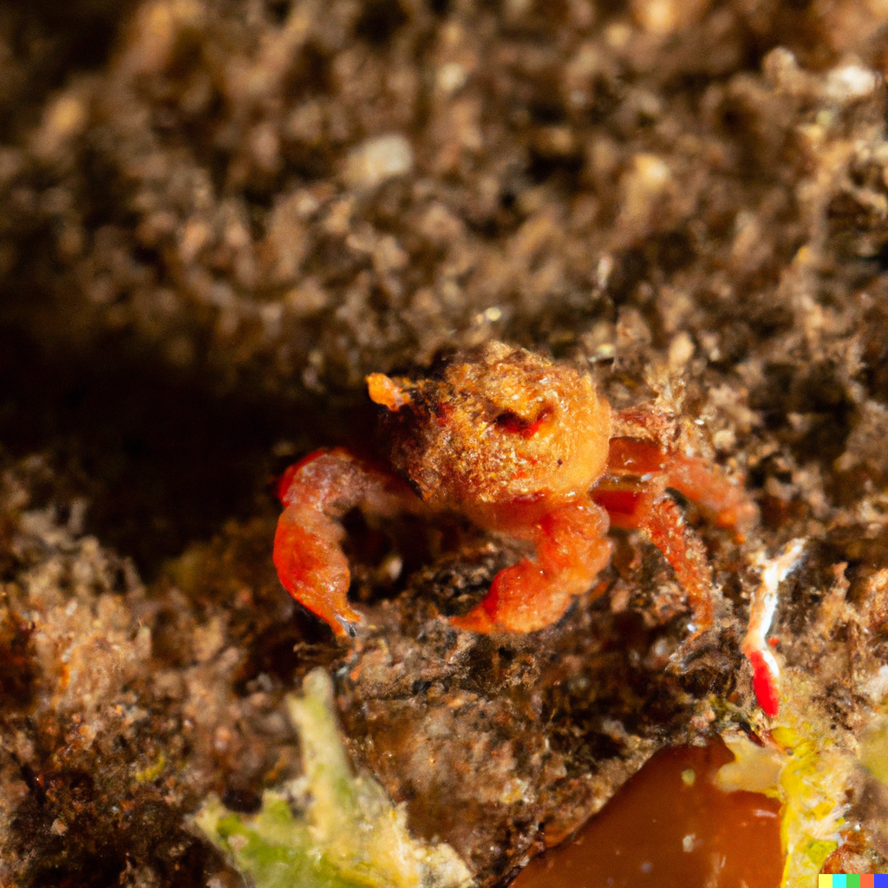
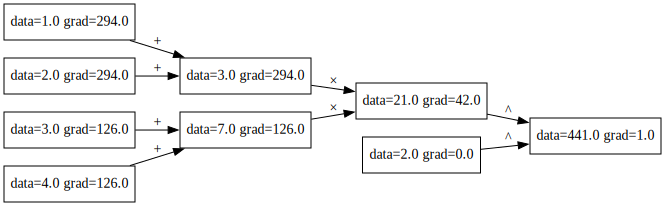
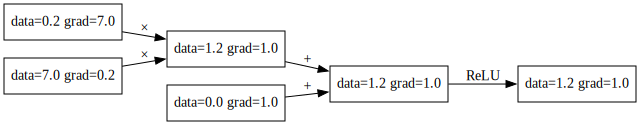
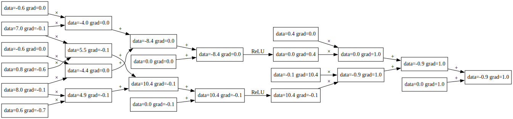

# rustygrad


Inspired by Andrej Karpathy's [micrograd](https://github.com/karpathy/micrograd). This repo implements a tiny Autograd engine in Rust:

1. with a friendly API
2. an easy-to-understand implementation
3. in a minimal amount of code

The engine and the neural net are implemented in about 150 and 100 lines of code respectively (vs Andrej's 100 and 50)! About twice as long, but twice as fast!

#### Installation
```
cargo add rustygrad
```

#### Example usage

##### Value API

`Value` can be used to construct arbitrary DAG Neural Nets (directed acyclic graph). One way to think about it, is it can be used to model common mathematical expressions. For example,

$$ g = [(a + b) * (c + d)] ^ 2 $$

can be translated into a neural net as such:

```Rust
use rustygrad::Value;

fn main() {
    let a = Value::from(1.0);
    let b = Value::from(2.0);
    let c = Value::from(3.0);
    let d = Value::from(4.0);

    let g = ((&a + &b) * (&c + &d)).pow(2.0);
    g.backwards();  // compute gradients
}
```




Below is more complicated example (from micrograd) designed to show most of the supported Value operations `// and their Python micrograd version`

```Rust
fn main() {
    // a = Value(-4.0)
    // b = Value(2.0)
    let a = Value::from(-4.0);
    let b = Value::from(2.0);

    // c = a + b
    // d = a * b + b**3
    let mut c = &a + &b;
    let mut d = &a * &b + &b.pow(3.0);

    // c += c + 1
    // c += 1 + c + (-a)
    // d += d * 2 + (b + a).relu()
    // d += 3 * d + (b - a).relu()
    c += &c + 1.0;
    c += 1.0 + &c + (-&a);
    d += &d * 2.0 + (&b + &a).relu();
    d += 3.0 * &d + (&b - &a).relu();

    // e = c - d
    // f = e**2
    // g = f / 2.0
    // g += 10.0 / f
    let e = &c - &d;
    let f = e.pow(2.0);
    let mut g = &f / 2.0;
    g += 10.0 / &f;

    // print(f'{g.data:.4f}') # prints 24.7041, the outcome of this forward pass
    println!("{:.4}", g.borrow().data); // 24.7041

    // g.backward()
    // print(f'{a.grad:.4f}') # prints 138.8338, i.e. the numerical value of dg/da
    // print(f'{b.grad:.4f}') # prints 645.5773, i.e. the numerical value of dg/db
    g.backward();
    println!("{:.4}", a.borrow().grad); // 138.8338
    println!("{:.4}", b.borrow().grad); // 645.5773
}
```

```
cargo run --example engine
```

##### Neuron and MLP API
The library also exposes a `Neuron` and  Multilayer Perceptron `MLP`


```Rust
use rustygrad::{Neuron, MLP};

fn main() {
    // Create a Neuron 
    //  With input size of 2 (1 normal weight and 1 bias)
    //  With ReLu layer (true)
    let neuron = Neuron::new(2, true);

    // Output node
    let g = &neuron.forward(&vec![Value::from(7.0)]);


    // Create a 2x2x1 MLP net:
    //  Input  layer of size 2
    //  Hidden layer of size 2
    //  Ouput  layer of size 1
    let model = MLP::new(2, vec![2, 1]);

    // Some input vector of size 2
    let x = vec![Value::from(7.0), Value::from(8.0)];
    // Output Value node
    let g = &model.forward(x)[0];
}
```

```
cargo run --example graphviz
```

Neuron:


MLP:



#### Training a neural net

The file `mlp.rs` trains a MLP binary classifier (with 2 16-node hidden layers) on a toy `make_moons.csv` dataset. Since plots in rust are hard, for now, here is an ascii representation of the learned solution space:


```
. . . . . . . . . . . . . . . . . . . . . . . . . . . . . . . . . . . . . . . . 
. . . . . . . . . . . . . . . . . . . . . . . . . . . . . . . . . . . . . . . . 
. . . . . . . . . . . . . . . . . . . . . . . . . . . . . . . . . . . . . . . . 
. . . . . . . . . . . . . . . . . . . . . . . . . . . . . . . . . . . . . . . . 
. . . . . . . . . . . . . . . . . . . . . . . . . . . . . . . . . . . . . . . . 
. . . . . . . . . . . . . . . . . . . . . . . . . . . . . . . . . . . . . . . . 
. . . . . . . . . . . . . . . . . . . . . . . . . . . . . . . . . . . . . . . . 
. . . . . . . . . . . . . . . . . . . . . . . . . . . . . . . . . . . . . . . . 
. . . . . . . . . . . . . . . . . . . . . . . . . . . . . . . . . . . . . . . . 
. . . . . . . . . . . . . . . . . . . . . . . . . . . . . . . . . . . . . . . . 
. . . . . . . . . . . . . . . . . . . . . . . . . . . . . . . . . . . . . . . . 
. . . . . . . . . . . . . . . . . . . . . . . . . . . . . . . . . . . . . . . . 
. . . . . . . . . . . . . . . . . . . . . . . . . . . . . . . . . . . . . . . . 
. . . . . . . . . . . . . . . . . . . . . . . . . . . . . . . . . . . . . . . . 
. . . . . . . . . . . . . . . . . . * * * * * . . . . . . . . . . . . . . . . * 
. . . . . . . . . . . . . . . . . * * * * * * * . . . . . . . . . . . . . . * * 
. . . . . . . . . . . . . . . . . * * * * * * * * . . . . . . . . . . . . * * * 
. . . . . . . . . . . . . . . . . * * * * * * * * * . . . . . . . . . . * * * * 
. . . . . . . . . . . . . . . . . * * * * * * * * * * . . . . . . . . . * * * * 
. . . . . . . . . . . . . . . . * * * * * * * * * * * . . . . . . . . * * * * * 
. . . . . . . . . . . . . . . . * * * * * * * * * * * * . . . . . . * * * * * * 
. . . . . . . . . . . . . . . . * * * * * * * * * * * * * . . . . * * * * * * * 
. . . . . . . . . . . . . . . * * * * * * * * * * * * * * * * * * * * * * * * * 
. . . . . . . . . . . . . . . * * * * * * * * * * * * * * * * * * * * * * * * * 
. . . . . . . . . . . . . . * * * * * * * * * * * * * * * * * * * * * * * * * * 
. . . . . . . . . . . . . . * * * * * * * * * * * * * * * * * * * * * * * * * * 
. . . . . . . . . . . . . . * * * * * * * * * * * * * * * * * * * * * * * * * * 
. . . . . . . . . . . . . * * * * * * * * * * * * * * * * * * * * * * * * * * * 
. . . . . . . . . . . . . * * * * * * * * * * * * * * * * * * * * * * * * * * * 
. . . . . . . . . . . . * * * * * * * * * * * * * * * * * * * * * * * * * * * * 
. . . . . . . . . . . . * * * * * * * * * * * * * * * * * * * * * * * * * * * * 
. . . . . . . . . . . * * * * * * * * * * * * * * * * * * * * * * * * * * * * * 
. . . . . . . . . . . * * * * * * * * * * * * * * * * * * * * * * * * * * * * * 
. . . . . . . . . . . * * * * * * * * * * * * * * * * * * * * * * * * * * * * * 
. . . . . . . . . . * * * * * * * * * * * * * * * * * * * * * * * * * * * * * * 
. . . . . . . . . . * * * * * * * * * * * * * * * * * * * * * * * * * * * * * * 
. . . . . . . . . * * * * * * * * * * * * * * * * * * * * * * * * * * * * * * * 
. . . . . . . . . * * * * * * * * * * * * * * * * * * * * * * * * * * * * * * * 
. . . . . . . . * * * * * * * * * * * * * * * * * * * * * * * * * * * * * * * * 
. . . . . . . . * * * * * * * * * * * * * * * * * * * * * * * * * * * * * * * * 
```

```
cargo run --example mlp
```

#### Running tests
```
cargo test
```

#### How To Build?

If building Rustygrad from scratch something you are curious about check out [Rustygrad-from-scratch](https://github.com/Mathemmagician/rustygrad-from-scratch)

