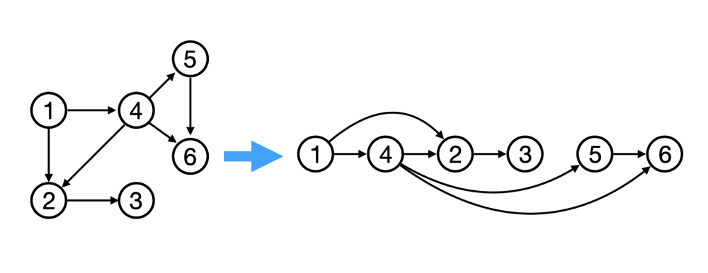

##### Building Rustygrad, a tiny ML engine that implements autograd

In this tutorial, we will actually build Rustygrad from scratch! Rust is a beautiful, but complicated language. Yes, it requires more thought than usual, but there is a reason for why it's one of the most loved languages - it truly makes you think diferently.

I hope that by the end, you will not simply learn how to build Rustygrad, but also feel as if you've learned something deeper.

#### 1. Goals

Let's refresh on what we are actually trying to build. We want to build a tiny ML library and be able to:

1. define simple neural nets
2. perform backwards propagation using autograd

Another important goal for us it to write as little amount of code as possible without sacrificing clarity. Clear and concise. 

#### 2. API is the King

One of the simplest way of defining neural nets is by defining a net of neurons and operations between them, a DAG (directed acyclic graph). We will have input nodes, hidden nodes and output nodes all represented as **nodes** in our DAG. Any mathematical operation, such as addition, multiplication or ReLU would be represented as directed **edges** leading to a new node. 

For example, if we add two nodes `A` and `B`, we would create a new node `C`. `C` will remember that it's an additive node derived from `A` and `B`. In our DAG, we would see an edge going from `A` to `C` and another edge from `B` to `C`.

This way of building up DAGs is quite common, so let's consider how it we would want the Rust API to look like before actually implement the engine.


```Rust
// main.rs

fn main() {
  // Some way to initialize Nodes
  let a = Value::new(3.0);
  let b = Value::new(-5.0);

  // Some way to combine nodes into a graph using math operations
  let c = &a + &b;

  // Some way to compute partial gradients
  c.backwards();
  
  // Some way to inspect node values and gradients
  println!("a = {:?}", a);
  println!("b = {:?}", b);
  println!("c = {:?}", c);
}
```

Here is another example of a DAG construction we would like to support:

```Rust
  // A net with 4 input nodes and various math operations
  let g = (( &a + &b ) * ( &c - &d.relu() )).pow(2.0);
```

Even though we haven't defined our `Value` struct or any of the mathematical operations, we now have an idea of what a pleasant API would look like. If you are familiar with TDD (Test Driven Development), I like to think of this approach as BDD (Beauty Driven Development). I really hope that ackronym doesn't mean something else.


##### Note on &

One compromise we have to make working with Rust is to use `&`. The reason we are defining `c` as `&a + &b` and not `a + b` is because of the concept of ownership. Rust needs to know when it can release memory. If a value is not owned by any variable, it gets released. Therefore, since the operation `a + b` passes `a` and `b` into addition method by value, it consumes their ownership, which means referring to `a` and `b` after that line would cause an error. Since we would like to inspect `a` and `b` later, we can let addition borrow references to `a` and `b` via the `&` operator. [Read more on ownership.](https://doc.rust-lang.org/book/ch04-02-references-and-borrowing.html) 

`&` is making our DAG construction process look a bit uglier, but it is also making it clear to the compiler what our intentions are. In return, the compiler rewards us with a speed boost. 


#### 3. The Engine

##### 3.1. Value

Let's think about how best to represent nodes in our DAG. Each nodes needs to know its value, its gradient and how to backward propagate the gradient to its children (previous) nodes via the Chain Rule.

```Rust
struct Value {
    data: f64,
    grad: f64,
    _prev: Vec<Value>,
    _backward: Option<fn(value: &Value)>,
}
```

We set `_backward` to be an optional function that will update the gradient of `_prev` nodes. It is optional because of input nodes which do not propagate gradient any further.

`_prev` is going to consist of variable number of children depending on the performed operation. For example, an additive node would have 2 children, while a ReLU node would have 1.

Let's also create a `new` method to simplify initialization:
```Rust
impl Value {
    fn new(data: f64) -> Value {
        Value {
            data,
            grad: 0.0,
            _prev: Vec::new(),
            _backward: None,
        }
    }
}
```

Now this struct has one crucial problem with it - ownership. Note that are we defining a recursive `Value` data structure in which we want to be able to reference other Values. Parent node shouldn't own its children, but only store some kind of references to them. 

If you try changing `_prev` from `Vec<Value>` to `Vec<&Value>`, you will run into a `missing lifetime specifier` error. This is because since Rust doesn't allow for dangling references (references which no longer point to a value), so it needs to be certain that parent Value doesn't outlive its children, which is not something we want to worry about. [More on Lifetimes](https://doc.rust-lang.org/book/ch10-03-lifetime-syntax.html).

Instead we will move our `Value` into a `ValueData` structure, and redefine `Value` to be a smart pointer to the `ValueData`

```Rust
use std::{ 
  cell::RefCell, 
  rc::Rc 
};

#[derive(Clone)]  // Allows reference cloning
struct Value(Rc<RefCell<ValueData>>);

struct ValueData {
    data: f64,
    grad: f64,
    _prev: Vec<Value>,
    _backward: Option<fn(value: &ValueData)>,
}
```

`Rc<RefCell<ValueData>>` is a Rust smart pointer that allows multiple owners to share mutable data by enforcing borrow rules at runtime. In other words, it allows us not to worry about ownership problems.

Let's also adjust our initializers

```Rust
// Old initializer
impl ValueData {
    fn new(data: f64) -> ValueData {
        ValueData {
          ...
        }
    }
}

// Creates a smart pointer
impl Value {
    fn new(value: ValueData) -> Value {
        Value(Rc::new(RefCell::new(value)))
    }
}

// Initalizes from a f64 like number
impl<T: Into<f64>> From<T> for Value {
    fn from(t: T) -> Value {
        Value::new(ValueData::new(t.into()))
    }
}
```

Now if you create a `Value` and try to access its value, you would have to add `.0.borrow()`. The `.0` part comes from the fact that `Value` stores `Rc RefCell` as its first nameless field. We then borrow and immutable reference to `ValueData` to access `data`.


```Rust
fn main() {
    let a = Value::from(-4.0);
    println!("data = {}", a.0.borrow().data);  // data = -4

    a.0.borrow_mut().data = 7.5;
    println!("data = {}", a.0.borrow().data);  // data = 7.5
}
```

Since `.0` would appear every time we borrow, let's remove the `.0` redundancy by implementing a Deref trait

```Rust
use std::{ ...
  ops,  // new import 
};

...

impl ops::Deref for Value {
    type Target = Rc<RefCell<ValueData>>;

    fn deref(&self) -> &Self::Target {
        &self.0
    }
}
```

A bit cleaner now:

```Rust
fn main() {
    let a = Value::from(-4.0);
    println!("data = {}", a.borrow().data);  // data = -4

    a.borrow_mut().data = 7.5;
    println!("data = {}", a.borrow().data);  // data = 7.5
}
```

Let's also define a Debug trait to simplify debugging.


```Rust
use std::{
    ...
    fmt::{self, Debug},
};

...

impl Debug for Value {
    fn fmt(&self, f: &mut fmt::Formatter<'_>) -> fmt::Result {
        let v = &self.borrow();
        write!(f, "data={} grad={}", v.data, v.grad)
    }
}
```

Your code should look like this:

```Rust
// main.rs
use std::{
    cell::RefCell,
    fmt::{self, Debug},
    ops,
    rc::Rc,
};

#[derive(Clone)]
struct Value(Rc<RefCell<ValueData>>);

struct ValueData {
    data: f64,
    grad: f64,
    _prev: Vec<Value>,
    _backward: Option<fn(value: &ValueData)>,
}

impl ValueData {
    fn new(data: f64) -> ValueData {
        ValueData {
            data,
            grad: 0.0,
            _prev: Vec::new(),
            _backward: None,
        }
    }
}

impl Value {
    fn new(value: ValueData) -> Value {
        Value(Rc::new(RefCell::new(value)))
    }
}

impl<T: Into<f64>> From<T> for Value {
    fn from(t: T) -> Value {
        Value::new(ValueData::new(t.into()))
    }
}

impl ops::Deref for Value {
    type Target = Rc<RefCell<ValueData>>;
    fn deref(&self) -> &Self::Target {
        &self.0
    }
}

impl Debug for Value {
    fn fmt(&self, f: &mut fmt::Formatter<'_>) -> fmt::Result {
        let v = &self.borrow();
        write!(f, "data={} grad={}", v.data, v.grad)
    }
}

fn main() {
    let a = Value::from(-4.0);
    println!("{:?}", a); // data=-4 grad=0

    a.borrow_mut().data = 7.5;
    println!("{:?}", a); // data=7.5 grad=0
}
```

##### 3.2 Operations

We are ready to implement our first operation - Addition. Let's first do the simplest thing and then see how we can improve.

```Rust
// Implement an Add trait to allow  Value + Value  operation
impl ops::Add for Value {
    type Output = Value;

    fn add(self, rhs: Self) -> Self::Output {
        // Initialize a new value with data 
        // set to the sum of previous values
        let out = Value::from(self.borrow().data + rhs.borrow().data);

        // Save reference clones into _prev 
        // for use in backwards propagation
        out.borrow_mut()._prev = vec![self.clone(), rhs.clone()];

        // Define how gradients propagate for addition -
        //  parent gradient is the same as children
        out.borrow_mut()._backward = Some(|value: &ValueData| {
            value._prev[0].borrow_mut().grad += value.grad;
            value._prev[1].borrow_mut().grad += value.grad;
        });
        out
    }
}
```

```Rust
fn main() {
    let a = Value::from(1.0);
    let b = Value::from(-4.0);
    let c = a + b;

    println!("{:?}", c);  // data=-3 grad=0
}
```

The one problem with this implementation is that we only implemented addition of `Value` with `Value`. But what about references? Adding `&Value` to `Value`,  `Value` to `&Value`, or `&Value` to `&Value`? Do we need to have multiple implementations of every operation? Yes.

Fortunately, there is a [impl_ops](https://docs.rs/impl_ops/0.1.1/impl_ops/index.html) crate that does it for us via `impl_op_ex!` macro

```
$ cargo add impl_ops
```

We can now substitute the Add trait with a macro:

```Rust
#[macro_use]
extern crate impl_ops;
...

impl_op_ex!(+ |a: &Value, b: &Value| -> Value {
    let out = Value::from(a.borrow().data + b.borrow().data);
    out.borrow_mut()._prev = vec![a.clone(), b.clone()];
    out.borrow_mut()._backward = Some(|value: &ValueData| {
        value._prev[0].borrow_mut().grad += value.grad;
        value._prev[1].borrow_mut().grad += value.grad;
    });
    out
});


fn main() {
    let a = Value::from(1.0);
    let b = Value::from(-4.0);
    let c = &a + &b;
    let d = a + b;

    println!("{:?}", c);  // data=-3 grad=0
    println!("{:?}", d);  // data=-3 grad=0
}
```

Multiplication is defined in a similar way with main difference in how the gradients get propagated

```Rust
impl_op_ex!(*|a: &Value, b: &Value| -> Value {
    let out = Value::from(a.borrow().data * b.borrow().data);
    out.borrow_mut()._prev = vec![a.clone(), b.clone()];
    out.borrow_mut()._backward = Some(|value: &ValueData| {
        let a_data = value._prev[0].borrow().data;
        let b_data = value._prev[1].borrow().data;
        value._prev[0].borrow_mut().grad += b_data * value.grad;
        value._prev[1].borrow_mut().grad += a_data * value.grad;
    });
    out
});
```

Let's also add ReLU and power functions

```Rust
impl Value {
    ...
    fn relu(&self) -> Value {
        let out = Value::from(self.borrow().data.max(0.0));
        out.borrow_mut()._prev = vec![self.clone()];
        out.borrow_mut()._backward = Some(|value: &ValueData| {
            value._prev[0].borrow_mut().grad += if value.data > 0.0 { value.grad } else { 0.0 };
        });
        out
    }

    fn pow(&self, power: f64) -> Value {
        let out = Value::from(self.borrow().data.powf(power));
        out.borrow_mut()._prev = vec![self.clone(), Value::from(power)];
        out.borrow_mut()._backward = Some(|value: &ValueData| {
            let base = value._prev[0].borrow().data;
            let p = value._prev[1].borrow().data;
            value._prev[0].borrow_mut().grad += p * base.powf(p - 1.0) * value.grad;
        });
        out
    }
}
```

Now that's actually all we need. The rest of the operations can be expressed in terms of operations we already defined

```Rust
// In addition or multiplication by a constant, just convert it to a Value
impl_op_ex_commutative!(+ |a: &Value, b: f64| -> Value { a + Value::from(b) });
impl_op_ex_commutative!(* |a: &Value, b: f64| -> Value { a * Value::from(b) });

// Negation is just multiplication by -1.0
impl_op_ex!(- |a: &Value| -> Value { a * (-1.0) });

// Subtraction is just addition with negated value
impl_op_ex!(- |a: &Value, b: &Value| -> Value { a + (-b) });

// Division is multiplication by a Value raised to -1.0 power
impl_op_ex!(/ |a: &Value, b: &Value| -> Value { a * b.pow(-1.0) });

// When add-assigning, simply replace the value with addition
// Note: &* allows to drop mut
impl_op_ex!(+= |a: &mut Value, b: &Value| { *a = &*a + b });
// Similar replacement
impl_op_ex!(*= |a: &mut Value, b: &Value| { *a = &*a * b });

// In division involving a constant, just convert it to a Value
impl_op_ex!(/ |a: &Value, b: f64| -> Value { a / Value::from(b) });
impl_op_ex!(/ |a: f64, b: &Value| -> Value { Value::from(a) / b });
```

We can create some very complex DAGs now! Here is an example that utilizes all of defined operations

```Rust
fn main() {
    let a = Value::from(-4.0);
    let b = Value::from(2.0);

    let mut c = &a + &b;
    let mut d = &a * &b + &b.pow(3.0);

    c += &c + 1.0;
    c += 1.0 + &c + (-&a);
    d += &d * 2.0 + (&b + &a).relu();
    d += 3.0 * &d + (&b - &a).relu();

    let e = &c - &d;
    let f = e.pow(2.0);
    let mut g = &f / 2.0;
    g += 10.0 / &f;

    println!("{:.4}", g.borrow().data); // 24.7041
}
```

In terms of building out the net, we are done! Believe it or not, this is all one needs to build Deep Neural Nets. Now, there is still one important ingredient missing that will allows us to actually train our nets - backpropagation. 

#### 3.3 Backpropagation

We now need to implement a `backwards` method which will recursively propagate gradients from the output nodes all the way back. An important caveat here is a node should only propagate its gradient once all of its parents have been visited. Each node might theoretically have multiple parents, and each of them will contribute its parts towards child's change in gradient. To ensure that, we will first build a [topological order](https://en.wikipedia.org/wiki/Topological_sorting) of all the nodes which will create a sorted array of Nodes in which each child node will appear after all of its parents.



```Rust
use std::{
    ...
    collections::HashSet,
};


impl Value {
    ...
    fn backward(&self) {
        let mut topo: Vec<Value> = vec![];
        let mut visited: HashSet<Value> = HashSet::new();
        self._build_topo(&mut topo, &mut visited);
        topo.reverse();

        self.borrow_mut().grad = 1.0;
        for v in topo {
            // Propagate gradient if backprop is defined
            if let Some(backprop) = v.borrow()._backward {
                backprop(&v.borrow());
            }
        }
    }

    fn _build_topo(&self, topo: &mut Vec<Value>, visited: &mut HashSet<Value>) {
        if visited.insert(self.clone()) {
            self.borrow()._prev.iter().for_each(|child| {
                child._build_topo(topo, visited);
            });
            topo.push(self.clone());
        }
    }
}
```

`_build_topo` performs a Depth First Search traversal in which we are adding children nodes before their parents (by keeping track of `visited`) to the `topo` vector of nodes. 

`backward` takes that topological order (reversed because we want parents first, children last), then sets the gradient of the output node to 1.0 and propagates in back.

There is one important adjustment we need to make to the `Value` since HashMap needs to know how generate a Value Hash and check for value equality. When a value is inserted into a HashMap, it keeps track of the hashes to know whether a certain value is present in the set. In languages like Python, every object has a unique `id`, but in Rust we actually need to implement a unique identifier explicitely. So let's add the unique identifier and implement `Hash`, `PartialEq` and `Eq` traits

```
$ cargo add uuid --features v4
```

Final Code
```Rust
#[macro_use]
extern crate impl_ops;

use std::{
    cell::RefCell,
    collections::HashSet,  // New
    fmt::{self, Debug},
    hash::{Hash, Hasher},  // New
    ops,
    rc::Rc,
};
use uuid::Uuid;  // New

#[derive(Clone)]
struct Value(Rc<RefCell<ValueData>>);

struct ValueData {
    data: f64,
    grad: f64,
    uuid: Uuid,  // New
    _prev: Vec<Value>,
    _backward: Option<fn(value: &ValueData)>,
}

impl ValueData {
    fn new(data: f64) -> ValueData {
        ValueData {
            data,
            grad: 0.0,
            uuid: Uuid::new_v4(),  // New
            _prev: Vec::new(),
            _backward: None,
        }
    }
}

impl_op_ex!(+ |a: &Value, b: &Value| -> Value {
    let out = Value::from(a.borrow().data + b.borrow().data);
    out.borrow_mut()._prev = vec![a.clone(), b.clone()];
    out.borrow_mut()._backward = Some(|value: &ValueData| {
        value._prev[0].borrow_mut().grad += value.grad;
        value._prev[1].borrow_mut().grad += value.grad;
    });
    out
});

impl_op_ex!(*|a: &Value, b: &Value| -> Value {
    let out = Value::from(a.borrow().data * b.borrow().data);
    out.borrow_mut()._prev = vec![a.clone(), b.clone()];
    out.borrow_mut()._backward = Some(|value: &ValueData| {
        let a_data = value._prev[0].borrow().data;
        let b_data = value._prev[1].borrow().data;
        value._prev[0].borrow_mut().grad += b_data * value.grad;
        value._prev[1].borrow_mut().grad += a_data * value.grad;
    });
    out
});

impl_op_ex_commutative!(+ |a: &Value, b: f64| -> Value { a + Value::from(b) });
impl_op_ex_commutative!(*|a: &Value, b: f64| -> Value { a * Value::from(b) });

impl_op_ex!(-|a: &Value| -> Value { a * (-1.0) });
impl_op_ex!(-|a: &Value, b: &Value| -> Value { a + (-b) });
impl_op_ex!(/ |a: &Value, b: &Value| -> Value { a * b.pow(-1.0) });
impl_op_ex!(+= |a: &mut Value, b: &Value| { *a = &*a + b });
impl_op_ex!(*= |a: &mut Value, b: &Value| { *a = &*a * b });
impl_op_ex!(/ |a: &Value, b: f64| -> Value { a / Value::from(b) });
impl_op_ex!(/ |a: f64, b: &Value| -> Value { Value::from(a) / b });

impl Value {
    fn new(value: ValueData) -> Value {
        Value(Rc::new(RefCell::new(value)))
    }

    fn relu(&self) -> Value {
        let out = Value::from(self.borrow().data.max(0.0));
        out.borrow_mut()._prev = vec![self.clone()];
        out.borrow_mut()._backward = Some(|value: &ValueData| {
            value._prev[0].borrow_mut().grad += if value.data > 0.0 { value.grad } else { 0.0 };
        });
        out
    }

    fn pow(&self, power: f64) -> Value {
        let out = Value::from(self.borrow().data.powf(power));
        out.borrow_mut()._prev = vec![self.clone(), Value::from(power)];
        out.borrow_mut()._backward = Some(|value: &ValueData| {
            let base = value._prev[0].borrow().data;
            let p = value._prev[1].borrow().data;
            value._prev[0].borrow_mut().grad += p * base.powf(p - 1.0) * value.grad;
        });
        out
    }

    fn backward(&self) {  // New
        let mut topo: Vec<Value> = vec![];
        let mut visited: HashSet<Value> = HashSet::new();
        self._build_topo(&mut topo, &mut visited);
        topo.reverse();

        self.borrow_mut().grad = 1.0;
        for v in topo {
            if let Some(backprop) = v.borrow()._backward {
                backprop(&v.borrow());
            }
        }
    }
    
    fn _build_topo(&self, topo: &mut Vec<Value>, visited: &mut HashSet<Value>) {  // New
        if visited.insert(self.clone()) {
            self.borrow()._prev.iter().for_each(|child| {
                child._build_topo(topo, visited);
            });
            topo.push(self.clone());
        }
    }
}

impl<T: Into<f64>> From<T> for Value {
    fn from(t: T) -> Value {
        Value::new(ValueData::new(t.into()))
    }
}

impl ops::Deref for Value {
    type Target = Rc<RefCell<ValueData>>;
    fn deref(&self) -> &Self::Target {
        &self.0
    }
}

impl Debug for Value {
    fn fmt(&self, f: &mut fmt::Formatter<'_>) -> fmt::Result {
        let v = &self.borrow();
        write!(f, "data={} grad={}", v.data, v.grad)
    }
}

impl Hash for Value {  // New
    fn hash<H: Hasher>(&self, state: &mut H) {
        self.borrow().uuid.hash(state);
    }
}

impl PartialEq for Value {  // New
    fn eq(&self, other: &Self) -> bool {
        self.borrow().uuid == other.borrow().uuid
    }
}

impl Eq for Value {}  // New

fn main() {
    let a = Value::from(-4.0);
    let b = Value::from(2.0);

    let mut c = &a + &b;
    let mut d = &a * &b + &b.pow(3.0);

    c += &c + 1.0;
    c += 1.0 + &c + (-&a);
    d += &d * 2.0 + (&b + &a).relu();
    d += 3.0 * &d + (&b - &a).relu();

    let e = &c - &d;
    let f = e.pow(2.0);
    let mut g = &f / 2.0;
    g += 10.0 / &f;

    println!("{:.4}", g.borrow().data); // 24.7041

    g.backward();
    println!("{:.4}", a.borrow().grad); // 138.8338
    println!("{:.4}", b.borrow().grad); // 645.5773
}
```

That's right, we now have a fully functioning DAG neural net with backwards propagation!